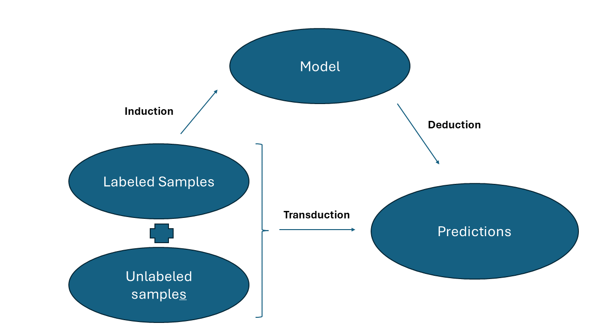
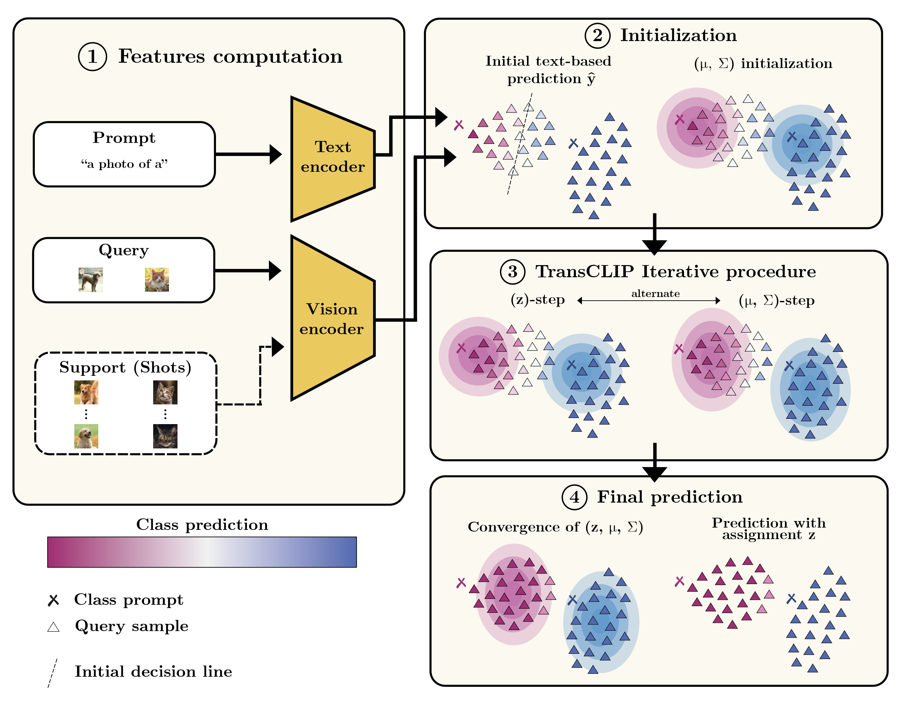

# Starter Guide

We will first dive into zero-shot in Vision-Language Models and the difference between transduction and induction before explaining our approach and our implementation. Let’s get started!

## Table of Contents

1. [How Can Vision-Language Models Be Used for Zero-Shot Prediction?](#how-can-vision-language-models-be-used-for-zero-shot-prediction)
2. [Understanding Transduction versus Induction](#understanding-transduction-versus-induction)
3. [Step-by-Step TransCLIP Breakdown ](#step-by-step-transclip-breakdown)
4. [Our Code Line by Line](#our-code-line-by-line)

## How can Vision-Language Models be used for zero-shot prediction?

#### Text Embedding Creation
Vision-language models like CLIP can effectively generalize to new classes without the need for retraining. Here's how it works:

To create text embeddings for new classes, you can use a simple templating technique. For instance, by prefixing the name of the class with a phrase like "a photo of a," we can generate a textual representation of any class.

**Example:** If we introduce a new category such as "polar bear," the model generates the text embedding by processing the phrase "a photo of a polar bear.".

#### Comparison with Image Embeddings
Once the text embeddings are generated, they can be directly compared to image embeddings:
- **Embedding Matching:** The model computes the similarity between the embeddings of new images and the newly generated text embeddings. This is done using cosine similarity, which measures the cosine of the angle between two vectors in the high-dimensional space.
- **Zero-Shot Prediction:** The model predicts that the class of a new image corresponds to the class whose text embedding is most similar to the image's embedding. This allows the model to make accurate predictions for images of classes it has never explicitly seen during training, effectively performing zero-shot learning.

The Figure below summarizes this procedure:

<p align="center">
  
  <br>
  <em>Figure 1: <a href="https://arxiv.org/abs/2103.00020">CLIP</a> can be used for zero-shot prediction with only the name of the classes to classify.</em>
</p>

Our TransCLIP approach relies heavily on these zero-shot capabilities and improve them drastically thanks to **Transduction**.

## Understanding Transduction versus Induction
From [Wikipedia](https://en.wikipedia.org/wiki/Transduction_(machine_learning)): "Transductive inference is reasoning from observed, specific (training) cases to specific (test) cases. In contrast, induction is reasoning from observed training cases to general rules, which are then applied to the test cases." Let's examine this more closely:

<p align="center">
  
  <br>
  <em>Figure 2: Transduction learns direct rule from test data.</em>
</p>

### Induction

Induction is the most common approach in traditional machine learning. It involves learning a general rule from training data, which is then applied to make predictions on new, unseen data. The process can often be summarized in two main steps:

- **Learn:** The model is trained on a labeled dataset, learning relationships and patterns within the data.
- **Generalize:** The learned model is used to predict outcomes on new instances, independently of each other (sequentially).

**Example:** In a spam detection system, the model learns from a set of emails labeled as "spam" or "not spam". Once trained, the model can classify new emails based on the general rules it derived from the training data.

### Transduction

Transduction focuses on predicting the labels of a specific set of test samples, using both the training data (if available, e.g., in the few-shot setting) and the test data during the inference process:

- **Direct Prediction:** The model makes predictions by relating the unseen test samples directly to the training samples and between themselves, leveraging both labeled and unlabeled data.
- **Specificity:** Transduction learns information specifically useful for the provided test data, rather than learning a general rule that applies beyond those samples. In this sense, transduction can often be seen as an easier task than learning an all new inductive model, which is especially convenient when starting from large foundation models, or when two few samples are available to learn strong universal rules.

**Example:** In a spam detection system, the model might use both labeled and unlabeled emails to better determine the boundaries of "spam" or "not spam" categories. This method allows the model to take into account all the samples at once.


## Step-by-Step TransCLIP Breakdown 

The Figure below summarizes the main steps of our TransCLIP procedure.

<p align="center">
  
  <br>
  <em>Figure 3: TransCLIP summary in 4 steps.</em>
</p>

Let's break down the steps involved in the TransCLIP approach:

① **Computation of Image and Text Features:** In TransCLIP, image and text features are computed just once since the model parameters are not updated during the whole process. This design makes TransCLIP extremely efficient—requiring only a few seconds even for large-scale datasets like ImageNet. Additionally, it allows the model to handle multi-billion parameter models by processing each image sequentially. This is a significant advantage over prompt learning methods, which training dynamics often rely on mini-batch training and gradient computation, necessitating more computational resources.

② **Initialization of the variables:** 
  - **Prediction \(\hat{y}\):** An initial prediction is computed and used in subsequent steps to regularize the entire procedure. At this point, the prediction aligns with the zero-shot prediction, providing a baseline from which adjustments are made. Obviously in the example provided, a better decision line can be found by taking into account the query samples, this is the power of **Transduction**.
  - **Gaussian Mixture Model (GMM) parameters:**


③ **Alternating TransCLIP Steps:**
   - **z-Updates:** Prediction (`assignments`) z are computed for each sample, taking into account the GMM likelihood and its neighbours. These updates are regularized by the initial prediction \(\hat{y}\) of each point. Note that this step is solved iteratively/in a loop (since the z (`assignments`) of one point depends on other assignemnts of other points).
   - **Updates of the GMM:** The GMM updates allow for the adjustment of centroids and covariance matrix to better fit the features.
     
④ **Convergence and Prediction:**
   - Upon reaching convergence, the z (`assignments`) are utilized for predictions in a completely **Transductive** manner.


## Our code line by line 

The `TransCLIP_solver` function is the central component of our repository and applies transductive inference methods to vision-language models like CLIP.

### Zero-Shot Baseline
The function first computes a zero-shot baseline by calculating the cosine similarities between test features and text embeddings.

### Initialization
- **Assignment probabilities (`z`)**: These are initialized by taking the affinity between each query sample and the text embeddings. The affinity can also come from another few-shot method, and softmax is applied if needed.
```python
def init_z([...]):
    if softmax:
        y_hat = F.softmax(affinity, dim=1)
        z = F.softmax(affinity, dim=1)
    else:
        y_hat = affinity
        z = affinity
    return y_hat, z
```
- **Class centroids (`mu`)**: In the zero-shot setting, we take the 8 most confident `z` (initialized just before) of each class and compute the embedding mean.
```python
def init_mu([...]):
    [...]
    if few_shot:
        [...]

    else:
        mu = torch.zeros(K, 1, d, device=query_features.device)
        n_most_confident = 8
        topk_values, topk_indices = torch.topk(z, k=n_most_confident, dim=0)  # 8 pseudo-labels per class
        mask = torch.zeros_like(z).scatter_(0, topk_indices, 1)
        filtered_z = z * mask
        for c in range(K):
            class_indices = mask[:, c].nonzero().squeeze(1)
            class_features = query_features[class_indices]
            class_z = filtered_z[class_indices, c].unsqueeze( 1)
            combined = class_features * class_z
            component_mean = combined[:n_most_confident].mean(dim=0)
            mu[c, 0, :] = component_mean
    mu /= mu.norm(dim=-1, keepdim=True)
    return mu
```
- **Covariance (`sigma`)**: It is simply initialized to the identity matrix. The entries are weighted according to the feature dimensionality. Note that `sigma` is shared across all classes.
```python
def init_sigma([...]):
    std = (torch.eye(d).diag() * std_init).cuda()
    return std
```
- **Affinity matrix (`W`)**: We compute the query samples self-affinity matrix and truncate it to the most 3 closest neighbors. We employ a sparse representation for efficient memory consumption and inference speed.
```python
def build_affinity_matrix([...]):
    [...]
    if few_shot:
        [...]
    else:
        affinity = query_features.matmul(query_features.T).cpu()
        num_rows = num_samples
        num_cols = num_samples

    knn_index = affinity.topk(n_neighbors + 1, -1, largest=True).indices[:, 1:]
    row_indices = torch.arange(num_rows).unsqueeze(1).repeat(1, n_neighbors).flatten()
    col_indices = knn_index.flatten()
    values = affinity[row_indices, col_indices].to(device)
    W = torch.sparse_coo_tensor(torch.stack([row_indices, col_indices]).to(device), values, size=(num_rows, num_cols),
                                device=device)
    return W
```

### Iterative Optimization
The core of the function is an iterative optimization process, where the function alternately updates:
- **Assignment probabilities (`z`)**: These are updated based on the likelihood calculated from the Gaussian mixture model, adjusted by the relationships defined in the affinity matrix `W`.
```python
def update_z(...):
   [...]
    for it in range(...): # iterative procedure until convergence of the z variables
        intermediate = gmm_likelihood.clone() # log-likelihood of the GMM
        intermediate += (50 / (n_neighbors * 2)) * (
                W.T @ z + (W @ z[0:num_samples, :])[0:num_samples, :]) # affinity with the neighbooring points 
        # For numerical stability
        intermediate -= torch.max(intermediate, dim=1, keepdim=True)[0]
        intermediate = (y_hat ** lambda_value) * torch.exp(1 / 50 * intermediate)
        z[0:num_samples] = intermediate / torch.sum(intermediate, dim=1, keepdim=True)
    return z
```

- **Class centroids (`mu`)**: These are recalculated for each class with respect to the updated assignments of the previous step.
```python
def update_mu(...):
    affinity_unlabeled = z
    n_query = affinity_unlabeled.size(0)

    if few_shot:
        [...]

    weights = (1 / n_query) * affinity_unlabeled

    # Use einsum to compute the new_mu for each class in one pass
    new_mu = torch.einsum('ij,ik->jk', weights, query_features)

    if few_shot:
        [...]
    else:
        new_mu /= (1 / n_query * torch.sum(
            affinity_unlabeled, dim=0).unsqueeze(-1))
    new_mu = new_mu.unsqueeze(1)
    new_mu /= new_mu.norm(dim=-1, keepdim=True)
    adapter.mu = new_mu
    return adapter
```
- **Covariance (`sigma`)**: Adjustments to this parameter help refine the model's estimation of variance, improving the decision boundaries.
```python
def update_sigma(...):
    affinity_unlabeled = z
    n_query = affinity_unlabeled.size(0)
    if few_shot:
        [...]

    std = 0
    chunk_size = 2500 # Iterate over test_features in chunks to avoid large memory consumption
    
    for start_idx in range(0, n_query, chunk_size):
        end_idx = min(start_idx + chunk_size, n_query)
        query_features_chunk = query_features[start_idx:end_idx]

        # Compute the weighted sum of squared differences for the chunk
        chunk_result = (1 / n_query) * torch.einsum(
            'ij,ijk->k',
            affinity_unlabeled[start_idx:end_idx, :],
            # Use a chunk of affinity_unlabeled
            (query_features_chunk[:, None, :] - adapter.mu[None, :,
                                               0, :]) ** 2)

        # If this is the first chunk, initialize std; otherwise, accumulate
        if start_idx == 0:
            std = chunk_result
        else:
            std += chunk_result

    if few_shot and gamma_value > 0:
        [...]
    else:
        std /= (1 / n_query * torch.sum(
            affinity_unlabeled[:, :]))

    adapter.set_std(std)
    return adapter
```
### Validation and Testing
During each iteration, the function optionally evaluates the current model configuration against the validation dataset (for the few-shot setting) to tune gamma. It tracks the best performing configuration on validation data and uses it to report test accuracy. Note that no validation is performed for TransCLIP-ZS (zero-shot).

### Final Output
At the end of the iterative process, the function outputs the z (`assignments`) and the achieved test accuracy (at the best validation accuracy for the few-shot setting).
