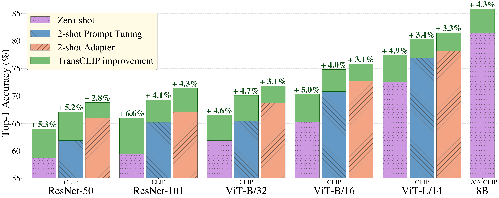

# Boosting Vision-Language Models with Transduction (TransCLIP)
The official implementation of [*Boosting Vision-Language Models with Transduction*](https://arxiv.org/abs/2406.01837).

Authors:
[Maxime Zanella](https://scholar.google.com/citations?user=FIoE9YIAAAAJ&hl=fr&oi=ao),
[Benoît Gérin](https://scholar.google.com/citations?user=MgT_oMAAAAAJ&hl=fr&oi=ao),
[Ismail Ben Ayed](https://scholar.google.com/citations?user=29vyUccAAAAJ&hl=fr&oi=ao).


We present TransCLIP, a novel and computationally efficient transductive approach designed for Vision-Language Models. TransCLIP is applicable as a plug-and-play module on top of popular inductive zero- and few-shot models, consistently improving their performances.

<p align="center">
  
  <br>
  <em>Figure 1: TransCLIP improves significantly zero-shot models and few-shot methods based either on adapter or prompt tuning for a large variety of encoders, with size up to 8 billion parameters.</em>
</p>

## 🔥 Complementary projects w/ TransCLIP

TransCLIP has successfully enhanced remote sensing Vision-Language Models, achieving an average accuracy improvement of over **10%**. 

Feel free to check the [paper](https://arxiv.org/abs/2409.00698) and the [GitHub project](https://github.com/elkhouryk/RS-TransCLIP) !


## Table of Contents

1. [Installation](#installation) 
2. [Pre-computed prototypes](#pre-computed-prototypes) 
3. [Usage](#usage)
4. [Transductive Few-Shot baselines](#transductive-few-shot-baselines)
5. [Citation](#citation)
6. [Contact](#contact) 

For those new to Transduction and/or Vision-Language Models, we invite you to explore our [friendly guide](GUIDE.md) for an accessible introduction to the essential aspects of our project.

---

## Installation
This repository requires to install an environment and datasets:
### Environment
Create a Python environment with your favorite environment manager. For example, with `conda`: 
```bash
conda create -y --name TransCLIP python=3.10.0
conda activate TransCLIP
pip3 install -r requirements.txt
```
And install Pytorch according to your configuration:
```bash
pip3 install torch==2.0.1 torchaudio==2.0.2 torchvision==0.15.2
```
### Datasets
Please follow [DATASETS.md](DATASETS.md) to install the datasets.
You will get a structure with the following dataset names:
```
$DATA/
|–– imagenet/
|–– caltech-101/
|–– oxford_pets/
|–– stanford_cars/
|–– oxford_flowers/
|–– food-101/
|–– fgvc_aircraft/
|–– sun397/
|–– dtd/
|–– eurosat/
|–– ucf101/
|–– imagenetv2/
|–– imagenet-sketch/
|–– imagenet-adversarial/
|–– imagenet-rendition/
```

## Pre-computed prototypes
If you'd like to apply TransCLIP on top of pre-computed prototypes, please download the textual features of CoOp and TaskRes on the 11 datasets in this [Drive link](https://uclouvain-my.sharepoint.com/:f:/g/personal/maxime_zanella_uclouvain_be/Eh8tx6h-hHxMigBcnMveB44BNhFvjXVlnawSZDVI-H1ZsQ?e=xSgeOA) and go to [TransCLIP-ZS on top of few-shot learning method](transclip-zs-on-top-of-few-shot-learning-method) to use them properly with our code. See [Contact](#contact) if you have any inquiries about missing embeddings. 

The drive is organized as follows:
- `Few-shot/` 
  - `method/`: the few-shot method (coop, or taskres, ...)
    - `encoder/`: architecture name (rn50, rn101, vit_b32, vit_b16, vit_l14), we recommend starting with vit_b16.
      - `Xshots/`: number of shots (X=1,2,4,8,16).
        - `dataset/`: name of the dataset (see above)
          - `seedY/`: seed number (Y=1,2,3)
            - `text_features.pt` : textual features


---

## Usage
We present the basic usage to get started with our method. You have to pass the datasets folder path and the pre-computed prototypes folder path. Each script has pre-set parameters but you can change them manually.

### CLIP + TransCLIP-ZS
TransCLIP-ZS based on the textual embeddings of the zero-shot model.

- **Zero-Shot setting**

Here is an example for the imagenet dataset, with the CLIP-ViT-B/16 architecture, and seed 1:
```bash
python3 main.py --root_path /path/to/datasets/folder --dataset imagenet --method TransCLIP --backbone vit_b16 --seed 1
```

To run the whole experiment, use the following command:
```bash
bash ./scripts/transclip_zs.sh /path/to/datasets/folder vit_b16
```

### CLIP + TransCLIP-FS
TransCLIP-FS based on the textual embeddings of the zero-shot model with additional shots (labeled support set).

- **Transductive Few-Shot setting**

Here is an example for the imagenet dataset, with the CLIP-ViT-B/16 architecture, 2 shots, and seed 1:
```bash
python3 main.py --root_path /path/to/datasets/folder --dataset imagenet --method TransCLIP --backbone vit_b16 --shots 2 --seed 1
```
  
To run this experiment, use the following command:
```bash
bash ./scripts/transclip_fs.sh /path/to/datasets/folder vit_b16 2
```

### TransCLIP-ZS on top of few-shot learning method
To execute TransCLIP-ZS on top of inductive few-shot methods (e.g. CoOp prompt).

- **Few-Shot setting**

In this setting, the test set should come from the same dataset as the training (support) set of the inductive few-shot method. To run this experiment, use the following command:
```bash
bash ./scripts/fewshot_atop.sh /path/to/datasets/folder /path/to/prototypes/folder vit_b16 coop 2
```

- **Cross-dataset setting**

In this setting, the test set is typically different from the training (support) set of the inductive few-shot method (16-shot imagenet in our case). To run this experiment, use the following command:
```bash
bash ./scripts/crossdataset_atop.sh /path/to/datasets/folder /path/to/prototypes/folder vit_b16 coop
```

- **Domain-generalization setting**

In this setting, the test set is typically another variant of imagenet while the inductive few-shot method was trained on imagenet (16-shot). To run this experiment, use the following command:
```bash
bash ./scripts/domaingeneralization_atop.sh /path/to/datasets/folder /path/to/prototypes/folder vit_b16 coop
```

---

## Transductive Few-Shot baselines

You can run the transductive few-shot baselines by using (and modifying) the following command:

```bash
bash ./scripts/transductive_baselines.sh /path/to/datasets/folder vit_b16 transductive_finetuning 4
```
You can select among `{transductive_finetuning; bdcspn; laplacian_shot; ptmap; tim}`.

## Acknowledgment
This repository is mainly based on [CoOp](https://github.com/KaiyangZhou/CoOp), [Tip-Adapter](https://github.com/gaopengcuhk/Tip-Adapter) and [CLAP](https://github.com/jusiro/CLAP). Thanks for their great work!

---

## Citation

If you find this repository useful, please consider citing our paper:
```
@article{zanella2024boosting,
  title={Boosting Vision-Language Models with Transduction},
  author={Zanella, Maxime and G{\'e}rin, Beno{\^\i}t and Ayed, Ismail Ben},
  journal={arXiv preprint arXiv:2406.01837},
  year={2024}
}
```

You can also cite our RS-TransCLIP paper:
```
@article{elkhoury2024enhancing,
title={Enhancing Remote Sensing Vision-Language Models for Zero-Shot Scene Classification},
author={Karim El Khoury and Maxime Zanella and Beno{\^\i}t G{\'e}rin and Tiffanie Godelaine and Beno{\^\i}t Macq and Sa{\"i}d Mahmoudi and Christophe De Vleeschouwer and Ismail Ben Ayed},
journal={arXiv preprint arXiv:2409.00698},
year={2024}
}
```

## Contact

For any inquiries, please contact us at [maxime.zanella@uclouvain.be](mailto:maxime.zanella@uclouvain.be) and [benoit.gerin@uclouvain.be](mailto:benoit.gerin@uclouvain.be) or feel free to [create an issue](https://github.com/MaxZanella/transduction-for-vlms/issues).


## License
[AGPL-3.0](https://github.com/MaxZanella/transduction-for-vlms/blob/main/LICENSE)


